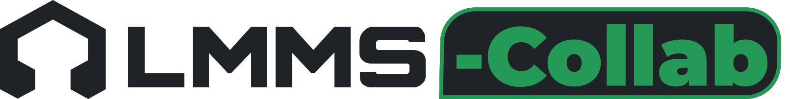

	<picture>
		<source media="(prefers-color-scheme: dark)" srcset="collab/assets/logo-dark.svg">
		
	</picture>
	
<b>Make music together, live, in LMMS.</b> 
	An unofficial version of <a href="https://lmms.io">LMMS</a> with real-time collaboration.

	

		<a href="https://github.com/adri21mg/lmms-collab/releases/latest"><b>Download for Windows</b></a>
		⦁︎
		<a href="collab/deploy/README.md">Run a server</a>
		⦁︎
		<a href="https://systmstudio.com">systmstudio.com</a>
	

	
<a href="https://ko-fi.com/systmstudio"> <b>Support me on Ko-fi</b></a>

<!-- GIFs: collab/assets/ -->

## What it adds

- **The same project, at the same time.** Notes, clips, tracks, patterns, mixer, automation, instruments, effects
  and their knobs: everyone sees every change as it happens.
- **See each other.** Everyone's cursor, name and color, which window they are in, and where they play from.
- **Shared files.** Samples and presets a project uses reach everybody, without sending files around.
- **Versions.** Save the project as it is now with a description, and go back to any version
  (optionally also into Perforce).
- **Safe to use.** A password for your server, encrypted connections, it reconnects by itself, and a plugin someone
  does not have never loses its settings.

Everything else is LMMS as you know it.

## Get started

1. **Download** the installer (or the portable ZIP) from [Releases](https://github.com/adri21mg/lmms-collab/releases/latest).
   It installs next to LMMS without touching it. Windows may say "Windows protected your PC" because the installer
   is not signed: *More info → Run anyway*.
2. **One of you hosts:** *Collaboration → Connect... → Host a session*, or run an always-on server on a PC or
   Ubuntu machine: [server guide](collab/deploy/README.md).
3. **The others join:** *Collaboration → Connect...*, the server's address with its port (e.g. `100.64.1.2:42871`;
   *Host a session* shows the exact ones to send), the password, and pick the project.

Playing with friends over the internet? [Tailscale](https://tailscale.com) is the easy and safe way: no ports to open.

Windows only for now. Based on LMMS 1.3.0-alpha.

## Credits

- **LMMS-Collab** by Adri, [Systm Studio](https://systmstudio.com), built entirely with
  [Claude](https://claude.com) by Anthropic.
- **LMMS** by the [LMMS developers](https://github.com/LMMS/lmms): all the credit for LMMS itself is theirs.
  LMMS-Collab is not affiliated with or endorsed by the LMMS project.
- License: [GPL-2.0-or-later](LICENSE.txt), like LMMS.

If LMMS-Collab is useful to you:

<a href="https://ko-fi.com/systmstudio"> <b>Support me on Ko-fi</b></a>

