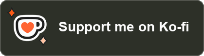
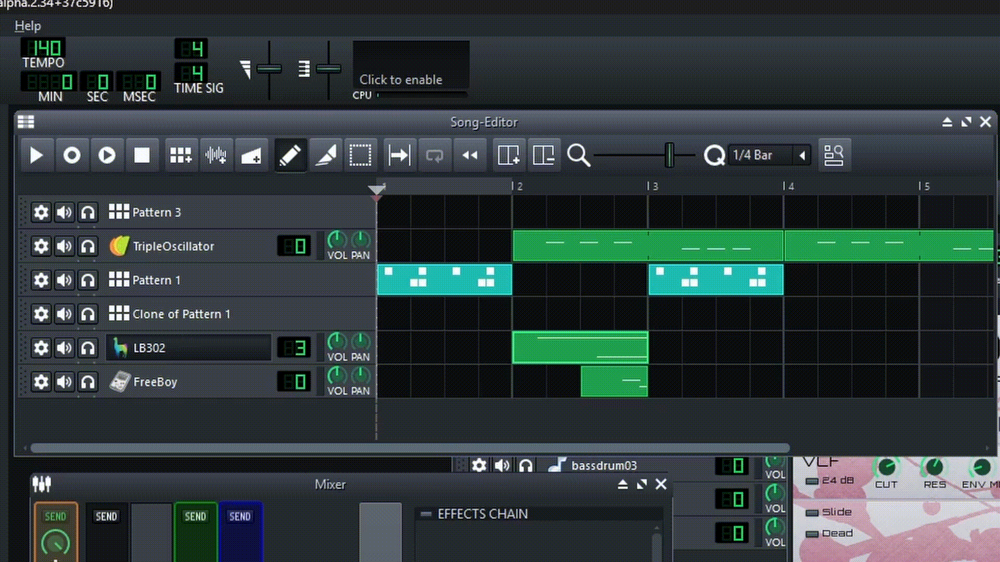
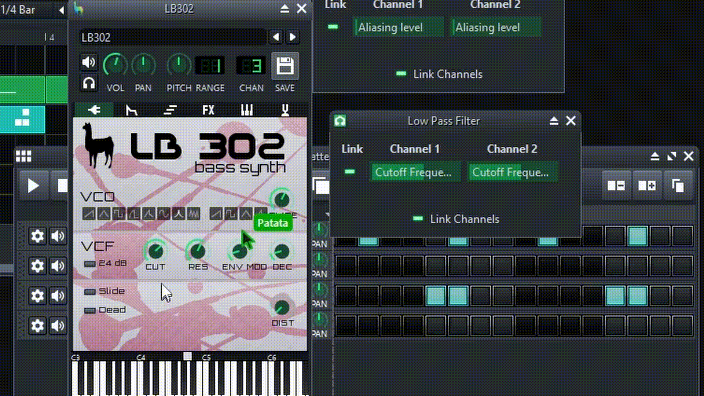

	<picture>
		<source media="(prefers-color-scheme: dark)" srcset="collab/assets/logo-dark.svg">
		
	</picture>
	
<b>Make music together, live, in LMMS.</b> 
	An unofficial version of <a href="https://lmms.io">LMMS</a> with real-time collaboration.

	

		<b>Download:</b>
		<a href="https://github.com/adri21mg/lmms-collab/releases/latest/download/LMMS-Collab-Setup-win64.exe"><b>Windows</b></a>
		·
		<a href="https://github.com/adri21mg/lmms-collab/releases/latest/download/LMMS-Collab-macOS-AppleSilicon.dmg"><b>macOS</b></a>
		·
		<a href="https://github.com/adri21mg/lmms-collab/releases/latest/download/LMMS-Collab-Linux-x86_64.AppImage"><b>Linux</b></a>
		 
		<a href="https://github.com/adri21mg/lmms-collab/releases/latest">All downloads</a>
		⦁︎
		<a href="collab/deploy/README.md">Run a server</a>
		⦁︎
		<a href="https://systmstudio.com">systmstudio.com</a>
	

	

## What it adds

- **The same project, at the same time.** Notes, clips, tracks, patterns, mixer, automation, instruments, effects
  and their knobs: everyone sees every change as it happens.
- **See each other.** Everyone's cursor, name and color, which window they are in, and where they play from.
- **Shared files.** Samples and presets a project uses reach everybody, without sending files around.
- **Versions.** Save the project as it is now with a description, and go back to any version
  (optionally also into Perforce).
- **Safe to use.** A password for your server, encrypted connections, it reconnects by itself, and a plugin someone
  does not have never loses its settings.

Everything else is LMMS as you know it.

## Get started

You need two things: **LMMS-Collab on every computer**, and **one of you hosting** the session.

### 1. Install it (everyone)

| System | File from [Releases](https://github.com/adri21mg/lmms-collab/releases/latest) |
|---|---|
| **Windows** 10/11 | `LMMS-Collab-Setup-win64.exe` (installer) or `LMMS-Collab-win64-portable.zip` (unzip and run) |
| **macOS**, Apple Silicon (M1 and later) | `LMMS-Collab-macOS-AppleSilicon.dmg` |
| **macOS**, Intel | `LMMS-Collab-macOS-Intel.dmg` |
| **Linux** | `LMMS-Collab-Linux-x86_64.AppImage`: `chmod +x` it, then run it |

The apps are not signed, so your system warns the first time:

- **Windows** says *"Windows protected your PC"*: click *More info → Run anyway*.
- **macOS**: drag the app to *Applications*. If you already have LMMS there, rename this one (for example
  *LMMS-Collab*) so it does not replace it. If macOS says the app *"is damaged"* or *"cannot be opened"*, open
  *Terminal* and run `xattr -dr com.apple.quarantine /Applications/LMMS-Collab.app`, then open it again.

It installs next to your normal LMMS without touching it: settings and projects are kept apart.

**Everyone in a session needs the same version.** If someone gets *"protocol version mismatch"*, update everybody to
the latest release.

### 2. One of you hosts the session

1. Open LMMS-Collab and choose *Collaboration → Connect...* (on macOS, *Collaboration* is in the menu bar at the
   top of the screen).
2. Click **Host a session** and pick a password for it (or leave it empty).
3. The dialog now lists the addresses your friends can use, like `100.64.1.2:42871` or `192.168.1.20:42871`.
   **Send them one of those and the password.**
4. Put your name and color in the same dialog, then either click **Share my current song as a new project...**
   (give it a name) or select a project and click **Join selected project**.

The session lasts while your LMMS-Collab is open. Projects are kept, so you can host them again another day. If
Windows asks whether `lmms-collab-server` may use the network, allow it on **private networks**.

Want a server that is always on, so anyone can join any time without you? See the [server guide](collab/deploy/README.md)
(Windows PC or Ubuntu/Debian machine).

### 3. The others join

1. *Collaboration → Connect...*
2. **Server:** the address the host sent you, with the port (e.g. `100.64.1.2:42871`).
3. **Password:** the host's password. Tick *Remember* if you like.
4. **Your name** and **your color**: this is how the others see your cursor.
5. Click **Connect**. The projects on the server appear; pick one and click **Join selected project**.

Joining replaces the song you have open, so save it first if you need it.

### 4. Make music together

- Everything you change (notes, clips, tracks, mixer, automation, instruments, effects and their knobs) appears for
  everyone at once. You see everyone's cursor and name, and which window they are in.
- Who is connected is shown at the top right of the window. *Collaboration → Show collaborators' playback position*
  shows where each person is playing from.
- **Saving is automatic**: the server saves the shared project every few seconds. *Collaboration → Save on server
  now* forces it.
- **Ctrl+Z / Ctrl+Y** undo and redo your own changes, not other people's.
- **Versions:** *Collaboration → Create version...* keeps the project as it is now, with a description, and
  *Collaboration → Versions...* goes back to any of them (for everyone; the state before is kept as a version too).
- **Your own copy:** *File → Save As...* saves the project on your computer at any time.
- Samples and presets the project uses are sent to everyone by themselves.
- To leave: *Collaboration → Disconnect* (the host: *Stop hosting the session*, or close LMMS-Collab).

### Playing over the internet

If you are not on the same Wi-Fi, use [Tailscale](https://tailscale.com) (free for personal use). It connects your
computers privately, with no ports to open on your router:

1. Everyone installs Tailscale and signs in.
2. The host shares their computer with the others from the Tailscale admin page (*Machines → (the computer) →
   Share...*), or invites them.
3. *Host a session* lists the Tailscale address (`100.x.y.z:42871`) first: that is the one to send.

Opening a port on your router also works; the [server guide](collab/deploy/README.md#how-others-reach-the-server)
explains it and how to keep it safe.

### Good to know

- **Plugins someone does not have** (a VST, for example) are silent for them, but their settings are kept, so they
  keep working for everyone who has them. LMMS-Collab tells you which ones are missing.
- **Encryption:** the always-on Ubuntu server encrypts connections. Hosting from LMMS or the Windows server does not,
  which is fine at home or through Tailscale (Tailscale encrypts everything), but not on an open port on the
  internet. *Connect...* shows whether your connection is encrypted.
- **If the connection drops**, LMMS-Collab reconnects by itself. If you changed something while offline, it offers
  to save your version as a separate file.
- Based on LMMS 1.3.0-alpha. Windows is the most tested; macOS and Linux are newer, so tell us if something is odd.

### If something goes wrong

- **"Cannot reach the server":** is the host's LMMS-Collab still hosting? Did you type the port (`:42871`)? With
  Tailscale, is it connected on both computers? Is the host's firewall allowing `lmms-collab-server`?
- **"Wrong password":** after several wrong tries, wait a minute before trying again.
- **"The server's certificate changed":** only trust the new one if the owner of the server tells you they made it.
- More in the [server guide](collab/deploy/README.md#if-something-goes-wrong).

## Credits

- **LMMS-Collab** by Adri, [Systm Studio](https://systmstudio.com), built entirely with
  [Claude](https://claude.com) by Anthropic.
- **LMMS** by the [LMMS developers](https://github.com/LMMS/lmms): all the credit for LMMS itself is theirs.
  LMMS-Collab is not affiliated with or endorsed by the LMMS project.
- License: [GPL-2.0-or-later](LICENSE.txt), like LMMS.

If LMMS-Collab is useful to you:

